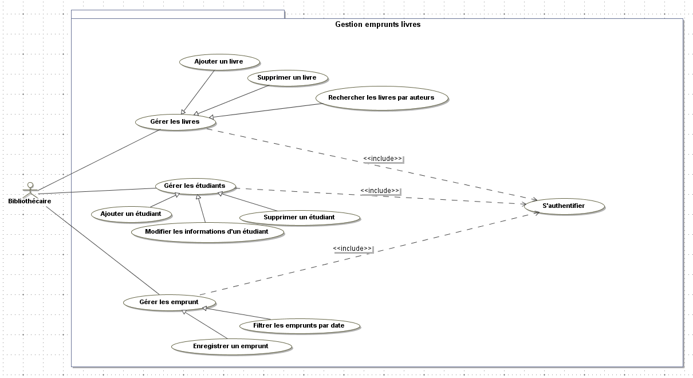
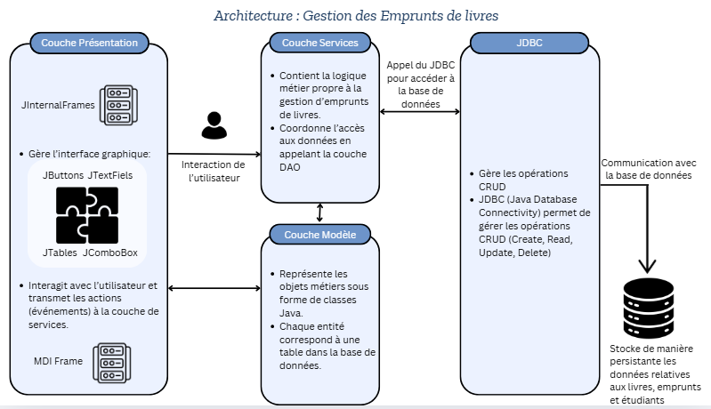

# 📚 Gestion des Emprunts de Livres  

## ❓ Contexte
De nos jours la gestion des ressources devient de plus en plus complexe, les bibliothèques et institutions académiques sont confrontées à des défis importants pour suivre et gérer les emprunts de livres. Les systèmes manuels ou obsolètes ne permettent pas une gestion efficace des prêts et retours, ce qui peut entraîner des erreurs, des pertes de temps et une mauvaise expérience utilisateur.

---

## ❓ Problématique
Les bibliothèques et institutions académiques ont besoin d'un système robuste et facile à utiliser pour gérer les emprunts de livres. Les systèmes actuels sont souvent inefficaces, ne permettant pas un suivi précis des emprunts, des retours, et des tendances d'utilisation des livres. Cela peut entraîner :
- Des erreurs de gestion,
- Des retards dans les retours,
- Une mauvaise expérience pour les utilisateurs.

---

## 🎯 Objectif
L'objectif de ce projet est de développer une application qui simplifie la gestion des prêts et retours de livres pour les bibliothèques et institutions académiques. L'application doit :
- Permettre un suivi précis des emprunts,
- Offrir une vision claire des tendances d'utilisation des livres,
- Fournir des fonctionnalités avancées pour la gestion des livres et des utilisateurs.

---

## 🔑 Fonctionnalités Principales
- **Gestion des Livres** : Ajout et suppression de livres.
- **Enregistrement des Emprunts** : Suivi des emprunts et retours de livres.
- **Filtrage des Emprunts** : Filtrage des emprunts par étudiant, livre, ou période.
- **Recherche de Livres** : Recherche rapide de livres par titre, auteur, ou catégorie.
- **Visualisation des Données** : Graphique Pie Chart pour analyser le taux d'emprunt par catégorie de livre.

---
## 🏷️ Logo


## 📌 Diagramme de classes


## 📌 Diagramme de cas d'utilisation


## 🗄️ Requêtes SQL pour la Base de Données

### 📌 Tables

```sql
CREATE TABLE livre (
    id INT AUTO_INCREMENT PRIMARY KEY,
    titre VARCHAR(50) NOT NULL,
    auteur VARCHAR(50) NOT NULL,
    categorie ENUM('roman', 'nouvelle', 'autobiographie', 'policier', 'romance') NOT NULL,
    disponible TINYINT NOT NULL
);

CREATE TABLE etudiant (
    id INT AUTO_INCREMENT PRIMARY KEY,
    nom VARCHAR(50) NOT NULL,
    prenom VARCHAR(50) NOT NULL,
    email VARCHAR(50) NOT NULL
);

CREATE TABLE emprunt (
    idEtudiant INT NOT NULL,
    idLivre INT NOT NULL,
    dateEmprunt DATE NOT NULL,
    dateRetour DATE NOT NULL,
    PRIMARY KEY (idEtudiant, idLivre),
    FOREIGN KEY (idEtudiant) REFERENCES etudiant(id) ON DELETE CASCADE,
    FOREIGN KEY (idLivre) REFERENCES livre(id) ON DELETE CASCADE
);  

CREATE TABLE user (
    login VARCHAR(100) NOT NULL PRIMARY KEY,
    password VARCHAR(100) NOT NULL,
    email VARCHAR(50) NOT NULL UNIQUE
);

```
## Architecture


## Technologies Utilisées:

-**NetBeans (Java)** : Pour le développement de l’application.    

-**MySQL**: Pour la gestion de la base de données.  

-**SWING** : Pour l'interface graphique et rendre l’application facile à utiliser.  

-**Bibliothèque graphique** : JFreeChart   

-**Outils de développement** :  
    - **IDE Java** : NetBeans
    - **Conception** : MagicDraw
    -  **Outil de gestion de base de données** : phpMyAdmin
    - **Accès aux données** : JDBC

## 🎥 Vidéo démonstrative:
https://github.com/user-attachments/assets/a5fc154d-eee7-4fd0-8259-5c9919ddd0d6